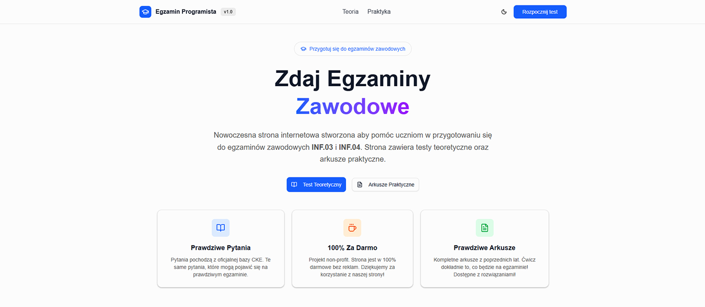
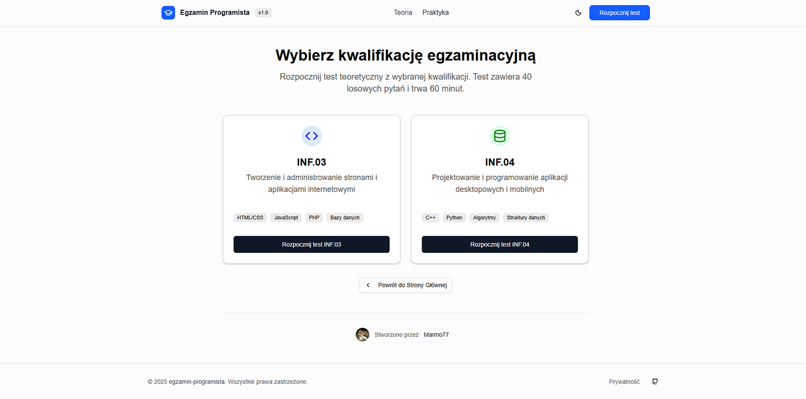
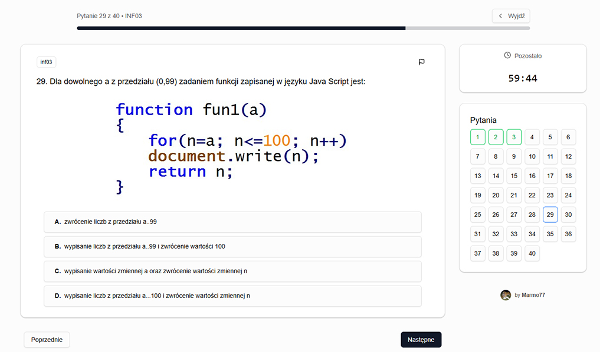
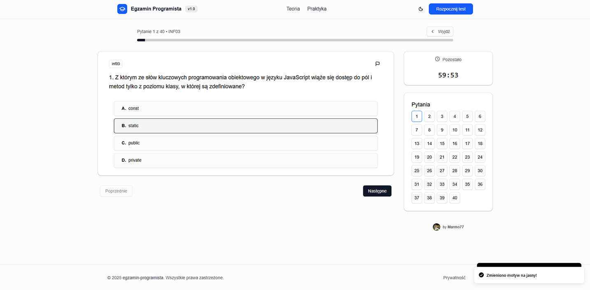
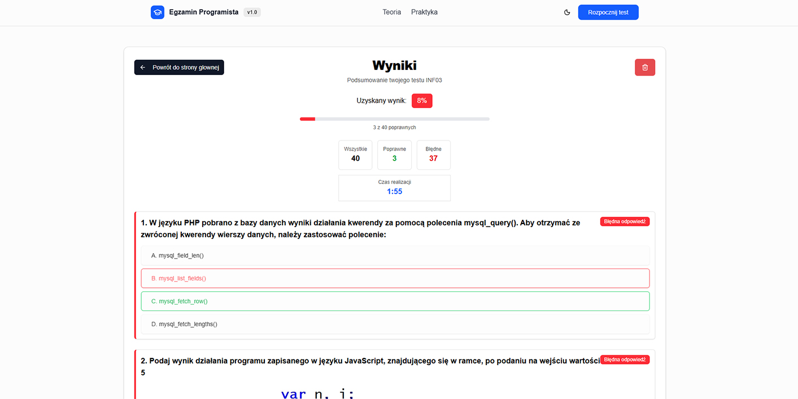
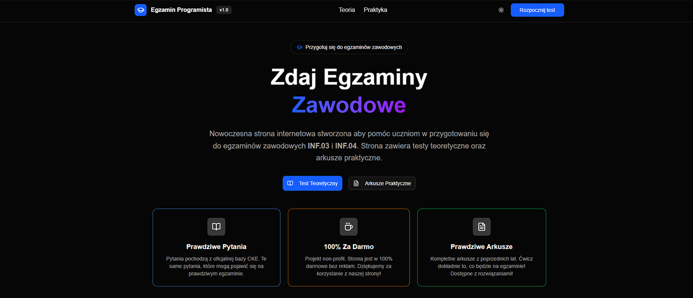
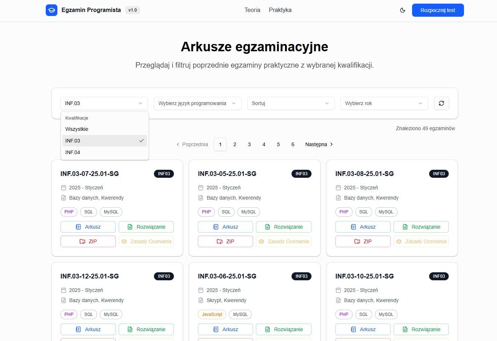

<div align="center" id="header">

# 🎓 Egzamin Programista

### Nowoczesna platforma do przygotowania się do egzaminów zawodowych INF.03 i INF.04

[](https://egzamin-programista.vercel.app/)
[](https://github.com/Marmo77/egzamin-programista)
[](LICENSE)



**[🌐 Zobacz Demo](https://egzamin-programista.vercel.app/) • [📝 LICENCJA](LICENSE) • [💬 Zgłoś Problem](https://github.com/Marmo77/egzamin-programista/issues)**

</div>

---

<div id="about">

## 📚 O Projekcie

**Egzamin Programista** to darmowa, open-source'owa platforma internetowa stworzona z myślą o uczniach techników informatycznych przygotowujących się do egzaminów zawodowych **INF.03** (Tworzenie i administrowanie stronami i aplikacjami internetowymi) oraz **INF.04** (Projektowanie i programowanie aplikacji).

### 🎯 Dlaczego powstał ten projekt?

Jako uczeń, który sam przeszedł przez stresujący proces przygotowań do egzaminów zawodowych, zdecydowałem się stworzyć narzędzie, które pomoże innym w skutecznej nauce. Platforma zawiera:

- ✅ **Ponad 2000 pytań** z oficjalnej bazy CKE
- ✅ **Symulacje prawdziwych egzaminów** z timerem 60 minut
- ✅ **Szczegółowe wyniki** z analizą błędów
- ✅ **Arkusze praktyczne** z poprzednich lat
- ✅ **100% za darmo** - bez reklam, bez ukrytych kosztów

</div>

---

<div id="features">

## ✨ Główne Funkcje

<div id="feature-tests">

### 🧪 Testy Teoretyczne

Rozwiązuj testy składające się z 40 losowych pytań z wybranej kwalifikacji. Każdy test symuluje prawdziwe warunki egzaminacyjne z limitem czasu 60 minut.



**Cechy testów:**
- 📊 40 losowych pytań z bazy ponad 2000 pytań
- ⏱️ Timer odliczający czas (60 minut)
- 🖼️ Pytania z obrazami (jak na prawdziwym egzaminie)
- 📝 Możliwość nawigacji między pytaniami
- 💾 Automatyczny zapis postępu

</div>

<div id="feature-questions">

### 📖 Pytania z Obrazami

Wiele pytań zawiera ilustracje, wykresy lub fragmenty kodu - dokładnie tak jak na oficjalnym egzaminie CKE.



</div>

<div id="feature-exam-interface">

### 💻 Interfejs Egzaminacyjny

Przejrzysty interfejs pokazuje postęp, pozostały czas oraz umożliwia szybką nawigację między pytaniami.



**Funkcje podczas testu:**
- 🎯 Wskaźnik postępu (np. "Pytanie 5 z 40")
- 🕐 Widoczny timer z ostrzeżeniem gdy zostaje mało czasu
- 🗺️ Mapa pytań (widok wszystkich 40 pytań)
- ✅ Oznaczenie odpowiedzianych pytań kolorem
- ⚠️ Możliwość zgłoszenia błędu w pytaniu

</div>

<div id="feature-results">

### 📊 Szczegółowe Wyniki

Po zakończeniu testu otrzymujesz pełną analizę swoich odpowiedzi wraz z poprawnymi odpowiedziami.



**Co pokazują wyniki:**
- 🎯 Procent poprawnych odpowiedzi
- ✅ Liczba poprawnych odpowiedzi
- ❌ Liczba błędnych odpowiedzi
- ⏱️ Czas realizacji testu
- 📝 Przegląd wszystkich pytań z zaznaczeniem:
  - Twojej odpowiedzi
  - Poprawnej odpowiedzi
  - Wyjaśnienia (aktualnie niedostępne)

</div>

<div id="feature-dark-mode">

### 🌙 Tryb Ciemny

Platforma wspiera tryb ciemny, który jest łagodniejszy dla oczu podczas długich sesji nauki.



</div>

<div id="feature-practice">

### 📄 Arkusze Praktyczne 


dostępne są:
- Kompletne arkusze egzaminacyjne z poprzednich lat
- Pliki do pobrania (ZIP)
- Rozwiązania przykładowe
- Zasady oceniania
- I więcej

</div>

</div>

---

<div id="technologies">

## 🛠️ Technologie

Projekt został zbudowany z wykorzystaniem nowoczesnych technologii webowych:

<div align="center">

| Frontend | Backend & Database | Narzędzia |
|----------|-------------------|-----------|
| ⚛️ **React 18** | 🗄️ **Supabase** | 📦 **Vite** |
| 📘 **TypeScript** | 🔐 **PostgreSQL** | 🎨 **Tailwind CSS** |
| 🧭 **React Router** | ☁️ **Vercel** | 🧩 **Shadcn/ui** |
| 🎣 **React Hooks** | 📊 **Vercel Analytics** | 🔔 **Sonner** |

</div>

**Dlaczego te technologie?**
- **React + TypeScript**: Zapewnia type-safety i łatwiejsze utrzymanie kodu
- **Supabase**: Darmowa baza danych w chmurze z prostym API
- **Tailwind CSS**: Szybkie stylowanie bez pisania CSS
- **Vercel**: Darmowy hosting z automatycznym deploymentem

</div>

---

<div id="how-to-use">

## 🚀 Jak Korzystać?

<div id="step-1">

### 1️⃣ Wejdź na Stronę

Odwiedź: **[egzamin-programista.vercel.app](https://egzamin-programista.vercel.app/)**

</div>

<div id="step-2">

### 2️⃣ Wybierz Kwalifikację

Na stronie głównej kliknij **"Test Teoretyczny"**, a następnie wybierz:
- **INF.03** - jeśli przygotowujesz się do egzaminu z tworzenia stron internetowych
- **INF.04** - jeśli przygotowujesz się do egzaminu z programowania aplikacji

</div>

<div id="step-3">

### 3️⃣ Rozpocznij Test

- Test składa się z **40 losowych pytań**
- Masz **60 minut** na rozwiązanie
- Możesz nawigować między pytaniami w dowolnej kolejności
- Na boku ekranu widzisz timer i mapę pytań

</div>

<div id="step-4">

### 4️⃣ Zakończ i Zobacz Wyniki

- Po odpowiedzeniu na wszystkie pytania (lub gdy skończy się czas) kliknij **"Zakończ"**
- Zobaczysz szczegółowe wyniki ze wszystkimi pytaniami
- Sprawdź swoje błędy i ucz się na nich!

</div>

<div id="tips">

### 💡 Wskazówki

- 📅 **Rób testy regularnie** - powtarzanie jest kluczem do sukcesu
- 🎯 **Analizuj błędy** - zawsze sprawdzaj dlaczego się pomyliłeś
- ⏱️ **Ćwicz pod presją czasu** - na prawdziwym egzaminie też będzie limit
- 📱 **Używaj na telefonie** - strona jest w pełni responsywna
- 🌙 **Wybierz tryb ciemny** - jeśli uczysz się wieczorem

</div>

<div id="found-problem">

### ❓ Znalazłeś bład w pytaniu?

  - Na stronie podczas rozwiązywania testu możesz użyć przycisku "Zgłoś pytanie" (flagą)
  - Opisz dokładnie jaki jest problem
</div>

</div>

---

<div id="for-developers">

## 👨‍💻 Dla Developerów (aktualnie niedostępne)

### Struktura Projektu

```
egzamin-programista/
├── public/
│   ├── inf03-images/      # Obrazy do pytań INF.03
│   └── inf04-images/      # Obrazy do pytań INF.04
├── src/
│   ├── components/        # Komponenty React
│   │   ├── Home/         # Strona główna
│   │   ├── Theory/       # Sekcja testów teoretycznych
│   │   ├── Practice/     # Sekcja praktyczna (w przygotowaniu)
│   │   └── ui/          # Komponenty UI (przyciski, karty, itp.)
│   ├── hooks/           # Custom React hooks
│   ├── types/           # Typy TypeScript
│   └── utils/           # Narzędzia pomocnicze
```

</div>

---

<div id="contributing">

## 🤝 Jak Pomóc?

Projekt jest open-source i każdy może wnieść swój wkład! Oto jak możesz pomóc:

### 🐛 Znalazłeś błąd?
- Zgłoś go w zakładce [Issues](https://github.com/Marmo77/egzamin-programista/issues)
- Opisz problem dokładnie (co się dzieje, co powinno się dziać)
- Dodaj screenshoty jeśli to możliwe

### 💡 Masz pomysł na nową funkcję?
- Otwórz [Issue](https://github.com/Marmo77/egzamin-programista/issues) z tagiem "enhancement"
- Opisz dokładnie jaką funkcję chciałbyś dodać i dlaczego

</div>

---

<div id="roadmap">

## 🗺️ Plany Rozwoju

### ✅ Gotowe
- [x] System testów teoretycznych (INF.03 i INF.04)
- [x] Ponad 2000 pytań w bazie danych
- [x] Timer i śledzenie postępu
- [x] Szczegółowe wyniki
- [x] System zgłaszania błędów w pytaniach
- [x] Tryb ciemny
- [x] Responsywny design (mobile/tablet/desktop)
- [x] Optimalizacja SEO

### 🚧 W Trakcie
- [ ] Sekcja arkuszy praktycznych z poprzednich lat
- [ ] Pobieranie plików ZIP z arkuszami
- [ ] Przykładowe rozwiązania do arkuszy

### 🔮 W Planach
- [ ] Historia wyników użytkownika
- [ ] Link do udestępnienia swojego wyniku
- [ ] Tryb praktyki (bez timera)
- [ ] Statystyki dla każdego pytania
- [ ] System tagów/kategorii pytań
- [ ] Użytkownik odpowiada na 1 pytanie na raz i odrazu otrzymuje odpowiedź
- [ ] Konto użytkownika (opcjonalne)

</div>

---

<div id="faq">

## ❓ Najczęściej Zadawane Pytania

<details>
<summary><b>Czy strona jest naprawdę darmowa?</b></summary>
<br>
Tak! Projekt jest całkowicie darmowy i nie zawiera reklam. Jest to projekt non-profit stworzony aby pomóc uczniom.
</details>

<details>
<summary><b>Skąd pochodzą pytania?</b></summary>
<br>
Wszystkie pytania pochodzą z oficjalnej bazy CKE (Centralna Komisja Egzaminacyjna) i są tymi samymi pytaniami które mogą pojawić się na prawdziwym egzaminie.
</details>

<details>
<summary><b>Czy mogę używać strony na telefonie?</b></summary>
<br>
Tak! Strona jest w pełni responsywna i działa świetnie na telefonach, tabletach i komputerach.
</details>

<details>
<summary><b>Czy moje wyniki są gdzieś zapisywane?</b></summary>
<br>
Wyniki są zapisywane lokalnie w Twojej przeglądarce (localStorage). Nie wysyłamy ich na żaden serwer, więc są całkowicie prywatne.
</details>

<details>
<summary><b>Co jeśli znajdę błąd w pytaniu?</b></summary>
<br>
Podczas rozwiązywania testu możesz kliknąć ikonę flagi obok pytania i zgłosić problem. Sprawdzimy zgłoszenie i naprawimy błąd.
</details>

<details>
<summary><b>Czy mogę pobrać stronę i używać offline?</b></summary>
<br>
Obecnie nie, ale jest to w planach. Na razie potrzebujesz połączenia internetowego aby korzystać ze strony.
</details>

</div>

---

<div id="support">

## 💖 Wsparcie

Jeśli projekt Ci się podoba i pomógł w przygotowaniach do egzaminu:

- ⭐ **Zostaw gwiazdkę** na [GitHub](https://github.com/Marmo77/egzamin-programista)
- 📢 **Podziel się** z kolegami z klasy
- 🐛 **Zgłaszaj błędy** i pomysły na ulepszenia
- 💻 **Dołącz do rozwoju** - każdy Pull Request jest mile widziany!

</div>

---

<div id="project-journey">

## 🚀 O Rozwoju Projektu

Ten projekt był dla mnie bardzo fajną przygodą, traktowałem go jako okazją do nauki reacta, baz danych, componentów, logicznego myślenia oraz pewnych działań.
Oczywiście że natrafiłem na wiele problemów np. kompunkacją między komponentami, zwłaszcza przy TypeScript'cie, który nie wybacza błędów!
Starałem się używać jak najmniej AI to możliwe, ponieważ miała to głównie być formą nauki.

### 📈 Statystyki Projektu

| Metryka | Wartość |
|---------|---------|
| ⏱️ **Czas pracy** | ~80-150 godzin |
| 💾 **Baza danych** | 2000+ pytań |
| 📝 **Linii kodu** | ~11000+ linii |
| 🎨 **Komponentów React** | 40+ komponentów |
| 🖼️ **Obrazów** | 650+ obrazów do pytań |
| 🐛 **Poprawek** | 100+ commitów |

### 🎓 Czego Się Nauczyłem?

Projekt był doskonałą okazją do nauki i praktyki w prawdziwym środowisku:

#### **Frontend Development**
- ⚛️ **React 18** - Hooks, Context, Lazy Loading, Memoization
- 📘 **TypeScript** - Typy, Interfejsy, Generics
- 🎨 **Tailwind CSS** - Utility-first styling, Responsive design
- 🧩 **Radix UI** - Accessible komponenty, Compound components
- 🔄 **React Router** - Routing, Navigation, Lazy routes

#### **Backend & Database**
- 🗄️ **Supabase** - PostgreSQL, Real-time subscriptions
- 📊 **SQL** - Queries, Joins, Indexing, Optymalizacja
- 🔐 **Authentication** (planowane) - User management
- 📁 **File Storage** - Obrazy pytań, CDN

#### **DevOps & Deployment**
- ☁️ **Vercel** - Continuous deployment, Edge functions
- 🔧 **Vite** - Build optimization, Hot Module Replacement
- 📊 **Analytics** - Performance monitoring
- 🌐 **SEO** - Meta tags, Sitemap, Structured data

#### **Soft Skills**
- 🎯 **Problem Solving** - Debugging, Optymalizacja performance
- 📝 **Dokumentacja** - README, Code comments
- 🐛 **Testing** - Error boundaries, Edge cases
- 🎨 **UI/UX Design** - User flow, Accessibility

### 🏆 Największe Wyzwania

-  **Rozpoczęcie projektu od samego zera oraz dobranie odpowiedniego "Tech Stack"**
-  **Komunikacja między bazą danych, a aplikacją**
-  **TypeScript fragmentami jest wstanie narobić problemów**
-  ***Problemów było znacznie więcej, ale o to chodzi w programowaniu, aby rozwiązywać problemy 🙂***
  
### 🎯 Czy Warto?

**ABSOLUTNIE TAK! 🎉**

Ten projekt nauczył mnie więcej niż setki tutoriali. **Uczenie się przez praktykę** to najlepsza metoda! Jeśli jesteś początkującym programistą - **zrób własny projekt**. Nie musi być idealny, ważne żeby był:

- ✅ **Rozwiązywał prawdziwy problem**
- ✅ **Wymagał nauki nowych rzeczy**
- ✅ **Mógł być pokazany w portfolio**
- ✅ **Pomagał innym ludziom**

### 📚 Polecane Zasoby

Jeśli chcesz stworzyć podobny projekt, polecam:

- 📖 [React Docs (beta)](https://react.dev) - Najlepsza dokumentacja React
- 🎨 [Tailwind CSS](https://tailwindcss.com) - Docs + przykłady
- 🗄️ [Supabase Docs](https://supabase.com/docs) - Backend w 5 minut
- 🧩 [Shadcn/ui](https://ui.shadcn.com/) - Accessible komponenty
- 📘 [TypeScript Handbook](https://www.typescriptlang.org/docs/) - Od podstaw do zaawansowanych

*(tutoriale na youtube też są również bardzo dobrą opcją na początek - (JavaScript Mastery, Bro Code))*
</div>

---


<div id="license">

## 📄 Licencja

Ten projekt jest dostępny na licencji MIT. Zobacz plik [LICENSE](LICENSE) dla więcej informacji.

</div>

---

<div id="credits" align="center">

## 👨‍💻 Autor


**Marmo77**

[](https://github.com/Marmo77)

---

### Stworzone z ❤️ dla uczniów techników informatycznych i programistów

**Powodzenia na egzaminach! 🎓🚀**

---

<sub>© 2025 Egzamin Programista. Wszystkie prawa zastrzeżone.</sub>

</div>
